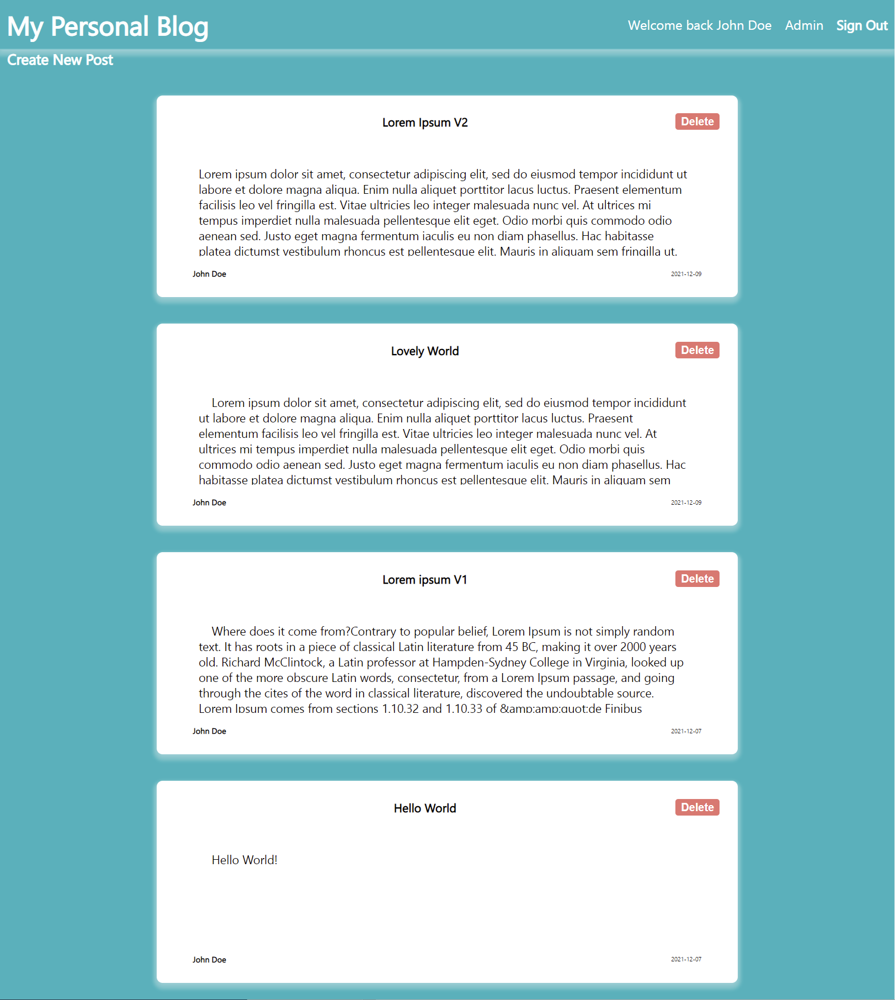

# Blog API Server-side

# Description

         It is a blog API server-side build for The Odin Project
         using NODE.JS and Express with cookie and CORS practice.

[<h2>Live Demo</h2>](https://samgliu.github.io/THO-blog-api-client/)

# Repositories

Server repository:https://github.com/samgliu/THO-blog-api  
Server API Demo:https://top-blog-api.onrender.com

Client repository:https://github.com/samgliu/THO-blog-api-client  
Client Demo:https://samgliu.github.io/THO-blog-api-client/

# Built With

-   Node.js
-   Express
-   passportJS

# Feature:

Create User  
Log in/out  
Auth  
Post  
Comment
Edit  
Server/Client
RESTful

# config

-   App.js  
     allowedDomains: must match the client side domain to avoid CORS errors.
